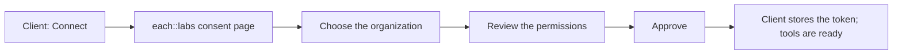
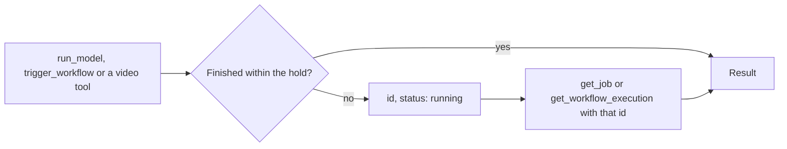

The each::labs MCP server is a hosted [Model Context Protocol](https://modelcontextprotocol.io) server at:

```
https://mcp.eachlabs.ai/mcp
```

Any MCP client that supports the Streamable HTTP transport with OAuth can connect to it. You sign in with your each::labs account in the browser; there is no API key to create or paste. Jobs run and bill as the organization you choose when you sign in.

## Clients

| Client | How to connect |
| --- | --- |
| Claude (claude.ai, Claude Desktop, mobile) | Add the each::labs plugin, or add the URL as a custom connector. Steps are on [Use each::labs in Claude](/mcp/claude-chat). |
| Claude Code | `claude mcp add --transport http eachlabs https://mcp.eachlabs.ai/mcp`, then run `/mcp` and approve the sign-in. |
| Codex | `codex mcp add eachlabs --url https://mcp.eachlabs.ai/mcp --oauth-resource https://mcp.eachlabs.ai/mcp` |
| Cursor and other MCP clients | Add `{ "url": "https://mcp.eachlabs.ai/mcp" }` to the client's `mcpServers` config. Per-client steps are in the [video MCP quickstart](/video/mcp/quickstart#connect-your-agent). |

`eachlabs` is the name the server gets in your client; choose another if you prefer.

Environments without a browser (CI, servers) can run the video tools locally with an API key instead. See [Headless and CI](/video/mcp/quickstart#headless-and-ci-api-key).

## Sign-in and billing

The first call opens the each::labs consent page in your browser. If you are not signed in to the dashboard, the page sends you through [sign-in](https://www.eachlabs.ai/sign-in) and back.



On the consent page you:

1. Choose the **Organization**. The page states it plainly: *Predictions will run and bill as &lt;organization&gt;*.
2. Review the permissions the client asks for (the [scopes](#scopes) below).
3. Click **Approve**.

| What | Value |
| --- | --- |
| Credential | An OAuth token that your client stores. It never appears in the conversation and is never shown to the model. |
| Billed organization | The one chosen on the consent page. Every job behaves as if that organization had called the API itself, at the same prices as the REST API. |
| Signing in again | Not needed. The token is refreshed in the background. To bill a different organization, disconnect the server in your client and connect again. |
| Precondition | The organization needs a runner credential. If consent fails with *organization has no runner credential*, open the [dashboard](https://www.eachlabs.ai) once as that organization and try again. |

## Scopes

A scope is a permission your client asks for at sign-in. The consent page lists each one. A tool that needs a scope your token lacks is refused before anything is submitted, and nothing is billed for a refused call. A connection approved before a scope existed does not have it; disconnect and connect again to approve the full set.

| Scope | Grants |
| --- | --- |
| `predictions:create` | Run models and video tools, and poll the jobs you submitted |
| `predictions:read` | Read prediction status and results |
| `workflows:run` | Trigger workflow executions, and list and read workflows and executions |
| `workflows:read` | List and read workflows and executions |
| `uploads:create` | Request a signed upload URL for a file you give through the [upload card](/mcp/claude-chat#give-a-file-as-input) |

The model catalog tools (`search_models`, `get_model_schema`) need no scope.

## Long jobs

Every tool that creates a job waits for the result and returns it in the same call. The wait has a limit: the hosted server holds a call for about three minutes. A job still running when the hold ends returns its id with `status: "running"` instead of a result. The job keeps running on each::labs.



| The call that returned `running` | Continue with |
| --- | --- |
| `run_model` or a video tool | `get_job` with the `prediction_id` |
| `trigger_workflow` | `get_workflow_execution` with the `execution_id` |

Billing happens once, when the job runs, not per check.

## Tools

Tool names are lowercase with underscores. Every tool's schema is strict: a parameter the tool does not declare is rejected before submit, so nothing reaches the engine and nothing bills. Every tool carries a title and hints that tell the client whether it only reads or creates a billed job; Claude uses these to decide which calls need your confirmation. The full list with parameters, defaults and return values is the [MCP tool reference](/video/mcp/tools).

### Video

One tool per [Video API capability](/video/capabilities): `transcode`, `trim`, `captions`, `concat`, `scale`, `overlay` and the rest, plus `run_ffmpeg` and `get_job`. 46 tools in all. Per-client setup is in the [video MCP quickstart](/video/mcp/quickstart).

| Tool | Does | Scope |
| --- | --- | --- |
| A capability tool (`transcode`, `trim`, ...) | Runs that capability on the input URL and returns the output URL or analysis JSON | `predictions:create` |
| `run_ffmpeg` | Runs an ffmpeg command on the input URLs | `predictions:create` |
| `get_job` | Returns the status and result of a prediction | `predictions:read` or `predictions:create` |

### Model catalog and any model

Three tools cover the whole model catalog, not only video. They use the same catalog and the same prediction as [List models](/api/models/list-models) and [Create prediction](/api/predictions/create-prediction).

| Tool | Does | Scope |
| --- | --- | --- |
| `search_models` | Finds models by name; returns slug, name, type and pricing for each match | none |
| `get_model_schema` | Returns a model's input schema, so an input can be built from it | none |
| `run_model` | Runs a model by slug with an input matching its schema; waits for the result up to the hold | `predictions:create` |

### Workflows

Run and read the [workflows](/workflows/overview) your organization built in the dashboard. Creating or editing a workflow stays in the dashboard.

| Tool | Does | Scope |
| --- | --- | --- |
| `list_workflows` | Lists the organization's workflows: id, slug, name, status and counts | `workflows:read` or `workflows:run` |
| `get_workflow` | Returns one workflow: its definition, versions and input schema | `workflows:read` or `workflows:run` |
| `trigger_workflow` | Triggers a workflow version with inputs; waits for the result up to the hold | `workflows:run` |
| `get_workflow_execution` | Returns an execution's status and outputs | `workflows:read` or `workflows:run` |

Webhook settings are not exposed through these tools; the tool polls instead.

### File input

Tool inputs are URLs. A file attached to a Claude conversation cannot reach a connector tool, so the server provides an upload card that Claude shows inside the conversation.

| Tool | Does | Scope |
| --- | --- | --- |
| `request_file` | Shows the upload card with a one-line prompt, the kinds it accepts (`image`, `video`, `audio`) and how many files it expects (1 to 4) | none |
| `wait_for_upload` | Waits for the files the person uploads on the card and returns their public URLs | none |
| `presign_upload` | Called by the card, not by Claude or by you: returns a signed upload URL for the picked file's type | `uploads:create` |
| `file_uploaded` | Called by the card after the upload: returns the file's `public_url` | none |

Claude calls `wait_for_upload` right after showing the card. When the upload is done, the card writes a small receipt to storage, the waiting call returns the file list, and Claude continues on its own; the person sends nothing. In Claude, a generated image, video or audio result appears under the tool call in a result card with a link to the full file; a data result shows no card. The card renders in Claude on claude.ai, Claude Desktop and mobile. Clients that do not render it, Claude Code among them, take a public URL in the message instead. How to use the card is on [Use each::labs in Claude](/mcp/claude-chat#give-a-file-as-input).

## Searching this documentation

`https://docs.eachlabs.ai/mcp` is a different server. It searches these documentation pages and runs no models. To generate media, connect to `https://mcp.eachlabs.ai/mcp` as described above.

## Policies

Jobs are billed to the organization you approve; see [Billing & Limits](/video/billing-limits). [Acceptable Use](/video/acceptable-use) · [Abuse & Takedown](/video/abuse-and-takedown) · [Versioning & Deprecation](/video/versioning)
