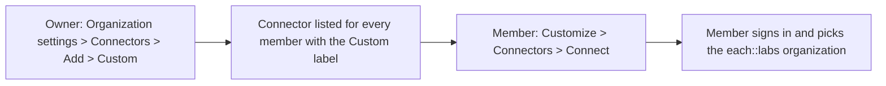
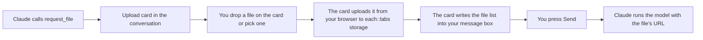

This page is for people using Claude in the browser, in the Claude desktop app or on a phone, and for Claude Code at the end. Codex, Cursor and other clients are covered on the [MCP Server](/mcp#clients) page.

## What you get

The each::labs plugin bundles two things:

| Part | What it is |
| --- | --- |
| Connector | The hosted MCP server at `https://mcp.eachlabs.ai/mcp`: the model catalog, `run_model`, the workflow tools, the video tools and the upload card. The [MCP Server](/mcp#tools) page lists them. |
| Skills | Twelve recipes Claude follows for common media tasks: which model fits, which inputs it takes, which tool to call. See [Skills](#skills). |

You can also add the connector on its own without the plugin; see [Connector without the plugin](#connector-without-the-plugin). Either way the sign-in and the tools are the same.

## Add the plugin

The same steps work in claude.ai and in the Claude desktop app. **Customize** is the page that holds your connectors, skills and plugins in both. On a Team or Enterprise plan, read [Team and Enterprise plans](#team-and-enterprise-plans) first.

<Steps>
  <Step title="Open Customize > Plugins">
    Go to **Customize > Plugins**.
  </Step>
  <Step title="Add the marketplace">
    Select **Add > Add marketplace** and enter the repository URL `https://github.com/eachlabs/claude-plugin`.
  </Step>
  <Step title="Add the plugin">
    Open the **each::labs** plugin and select **Add**.
  </Step>
  <Step title="Connect the bundled connector">
    Adding a plugin does not sign you in to anything. Open the plugin's **Connectors** tab. The `eachlabs` connector shows **Not added**: add it from this tab, then select **Connect**. The each::labs consent page opens; see [First sign-in](#first-sign-in).
  </Step>
</Steps>

The plugin's skills load whether or not you connect. A skill cannot reach each::labs until the connector shows **Connected**. Once added, the connector also appears under **Customize > Connectors**.

## Connector without the plugin

Add the server URL as a custom connector. You get the same tools and the same sign-in, without the skills: you describe the task and Claude chooses the tools itself.

<Steps>
  <Step title="Open Customize > Connectors">
    Go to **Customize > Connectors**.
  </Step>
  <Step title="Add a custom connector">
    Click **Add custom connector**.
  </Step>
  <Step title="Enter the server URL">
    Enter `https://mcp.eachlabs.ai/mcp`. Leave the OAuth client ID and secret empty; the server registers Claude itself.
  </Step>
  <Step title="Add and connect">
    Click **Add**, then **Connect**. The each::labs consent page opens; see [First sign-in](#first-sign-in).
  </Step>
</Steps>

On the Free plan you can add one custom connector.

## Team and Enterprise plans

Members cannot add a custom connector themselves. An Owner adds it once for the organization, and each member then signs in with their own each::labs account. On Enterprise plans, a member whose custom role includes managing the organization's libraries can add it too.



<Tabs>
  <Tab title="Owner: connector">
    <Steps>
      <Step title="Open organization connectors">
        Go to **Organization settings > Connectors**.
      </Step>
      <Step title="Add a custom connector">
        Select **Add**, then **Custom**. If Claude asks for the connector type, choose **Web**.
      </Step>
      <Step title="Enter the server URL">
        Enter `https://mcp.eachlabs.ai/mcp`. Leave the OAuth client ID and secret empty.
      </Step>
      <Step title="Add the connector">
        Click **Add**. The connector now appears under **Customize > Connectors** for members, with the **Custom** label.
      </Step>
    </Steps>
  </Tab>
  <Tab title="Owner: plugin">
    <Steps>
      <Step title="Open Plugins & skills">
        Go to **Organization settings > Plugins & skills**.
      </Step>
      <Step title="Add the marketplace">
        Select **Add**, then **Add marketplace**, and enter `https://github.com/eachlabs/claude-plugin`. The plugin appears on the **Inventory** tab.
      </Step>
      <Step title="Set who gets it">
        Open the menu at the end of the plugin's row, select **Default access**, and choose **Available to install**, **Installed by default** or **Required**.
      </Step>
      <Step title="Add the connector too">
        Availability does not add a plugin's bundled connectors. Add the each::labs connector in **Organization settings > Connectors** as the **Owner: connector** tab describes; members then connect it with their own account.
      </Step>
    </Steps>
  </Tab>
  <Tab title="Member">
    <Steps>
      <Step title="Open Customize > Connectors">
        Go to **Customize > Connectors**.
      </Step>
      <Step title="Find the custom connector">
        Find the each::labs connector with the **Custom** label.
      </Step>
      <Step title="Connect">
        Click **Connect**. The each::labs consent page opens; see [First sign-in](#first-sign-in).
      </Step>
    </Steps>

    With the plugin, the same **Connect** is also on the plugin's **Connectors** tab under **Customize > Plugins**.
  </Tab>
</Tabs>

## First sign-in

Connecting opens the each::labs consent page in a new browser tab.

1. If you are not signed in to the each::labs dashboard, the page sends you through [sign-in](https://www.eachlabs.ai/sign-in) and back to the consent page.
2. Choose the **Organization**. The page states: *Predictions will run and bill as &lt;organization&gt;*. Every job you run from Claude is charged to this organization at the same prices as the API.
3. Review the permissions listed (the [scopes](/mcp#scopes)) and click **Approve**.

Claude stores the resulting token and refreshes it in the background; you do not sign in again. The token never appears in the conversation. To bill a different organization, disconnect the connector under **Customize > Connectors** and connect again.

If the page fails with *organization has no runner credential*, open the [dashboard](https://www.eachlabs.ai) once as that organization, then connect again.

### Tool approvals

Before running a tool that creates something (a prediction, a workflow execution, an upload URL), Claude asks you to allow it. **Always allow** remembers the answer for that tool. Tools that only read (checking a job, listing models or workflows) run without a prompt.

You can turn the connector off for one conversation: click the **+** button in the chat and select **Connectors**, then turn each connector on or off for that conversation.

## Give a file as input

Most recipes start from your own photo, video or audio file. Tool inputs are URLs, and a file attached with Claude's paperclip stays inside Claude: it cannot reach a connector tool. When a model needs a file, Claude shows the each::labs **upload card** in the conversation instead. Put the file on the card, not on the paperclip.

The upload ends with a message for you to send. The card writes the list of uploaded files into your message box; you press **Send**, and Claude continues with the file's URL. Claude does not continue on its own.



| Step | What happens |
| --- | --- |
| 1 | You ask for the result you want: "turn this photo into a short clip". |
| 2 | Claude shows the upload card. The first time, Claude asks you to allow the each::labs app; allow it once. |
| 3 | Drop the file on the card or pick it with the card's button. On a phone the card opens the gallery. |
| 4 | The card uploads the file from your browser to each::labs storage and shows a thumbnail and progress. Nothing passes through Claude. |
| 5 | The card shows *Press Send in the message box to continue* and puts the file list into your message box as a draft. Above the box, Claude shows its red caution notice, *Use caution before running this prompt*. Claude shows this notice for any message an app prepares; it is standard. |
| 6 | Press **Send**. Claude continues with the uploaded file's URL as the model input. |

| Limit | Value |
| --- | --- |
| File kinds | Image, video or audio, as the recipe asks for |
| Files per card | 1 to 4 |
| File size | 100 MB per file |
| Sending | The upload ends with a message to send: press **Send**. The caution notice above the box is standard. |
| Storage | The file is kept for 180 days, as with [Upload file](/storage/upload-file) |
| Phone | The card opens the gallery picker. Add the connector on the web or desktop first; the phone app then has it. |
| Already have a URL | Paste a public URL in the message instead; no card is needed |
| Claude Code | Does not render the card. Give files as public URLs; see [Claude Code](#claude-code). |

## Skills

Claude loads a skill when your request matches its description. To pick one yourself, type `/` in the message box and choose it.

| Skill | Use it for |
| --- | --- |
| `eachlabs-image-generation` | New images from a text prompt: Flux, GPT Image, Gemini, Imagen, Seedream and other model families |
| `eachlabs-image-edit` | Editing an existing image: style transfer, background removal, upscaling, inpainting, virtual try-on, 3D, analysis |
| `eachlabs-video-generation` | New videos from text, images or reference inputs: transitions, motion control, talking head, avatars |
| `eachlabs-video-edit` | Editing an existing video: lip sync, translation, subtitles, audio merge, style transfer, extension |
| `eachlabs-music` | Songs, instrumentals, lyrics and podcasts; song extension, stem separation, song recognition |
| `eachlabs-voice-audio` | Text to speech, transcription with speaker labels, voice conversion |
| `eachlabs-face-swap` | Swapping faces between images |
| `eachlabs-fashion-ai` | Fashion model imagery, virtual try-on, runway videos, campaign visuals |
| `eachlabs-product-visuals` | Product photography and videos for e-commerce: product shots, background replacement, lifestyle scenes, 360-degree views |
| `eachlabs-workflows` | Running a workflow your organization built and reading its executions |
| `gpt-image-v2` | OpenAI GPT Image v2 for text to image and instruction-based edits |
| `bytedance-seedance-2-0` | ByteDance Seedance 2.0 for video with native audio, from text or from an image |

## When a tool says running

A tool waits for its job and returns the result in the same reply. The wait has a limit of about three minutes. A job still running at that point returns its id with `status: "running"` instead of a result. This is normal for long video renders and multi-step workflows; the job keeps running on each::labs.

Ask Claude to check on it: "is that job done?" Claude calls `get_job` for a model or video job, or `get_workflow_execution` for a workflow, and returns the result when it is ready. You are billed once, when the job runs, not for checking. Details are under [Long jobs](/mcp#long-jobs).

Results are URLs to the output files. Download anything you want to keep.

## Claude Code

Add the connector from the command line, then sign in:

```bash
claude mcp add --transport http eachlabs https://mcp.eachlabs.ai/mcp
```

Run `/mcp` inside Claude Code, approve `eachlabs`, and sign in when prompted. The tools appear once the sign-in completes.

| Difference from Claude in the browser | What to do |
| --- | --- |
| The upload card does not render | Give files as public URLs in the message |
| A plugin added under **Customize > Plugins** also syncs to Claude Code when you are signed in to the same account | Run `/reload-plugins` in that session, or start Claude Code again |

## Remove it

Go to **Customize > Connectors** and click **Remove**, or open the three-dot menu. A Team or Enterprise Owner removes the organization's copy under **Organization settings > Connectors**. To remove the plugin, open it from **Customize > Plugins**, open its menu and select **Remove**; the connector stays until you remove it too.

Policies: [Acceptable Use](/video/acceptable-use) · [Abuse & Takedown](/video/abuse-and-takedown) · [Billing & Limits](/video/billing-limits)
